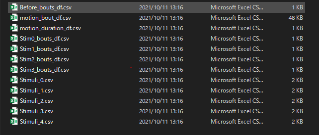

# Worm_optogenetics

====

This script is for analyzing Optogenetics experiment data.

## Input data type
sequential images (.jpg, .png)

## How to analysis  
1. Image subtraction analysis (quantify the mobility)
   1. run "Image_subtraction_analysis_multiple.py" 
   2. select the upper directory of seq images.
   3. wait for several minutes (depends on CPU)
2. Find the stimulation timing
   1. Open a sequential images with Fiji (NIH)
   2. check images and write down the blue light stimulation timing 
3. Analyze the behavior with script
   1. Open "Optogenetics_analysis.py"
   2. put the stimulation timing (e.g. stimuli_list = [1346, 1884, 2259, 2727, 3122])
   3. run the script 
   4. select the subtraction analysis file (e.g. "locomotor_activity_th=7.csv")

## Output 
following files are positioned under dfs

---  
## Licence  
[MIT]  

---
## Author  
[Shinichi Miyazaki] https://github.com/Rukaume

